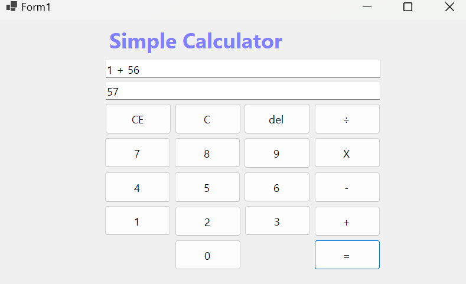
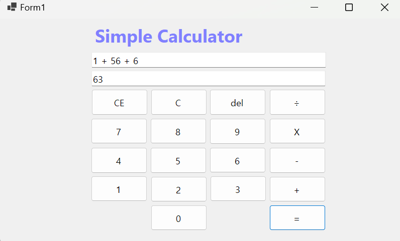
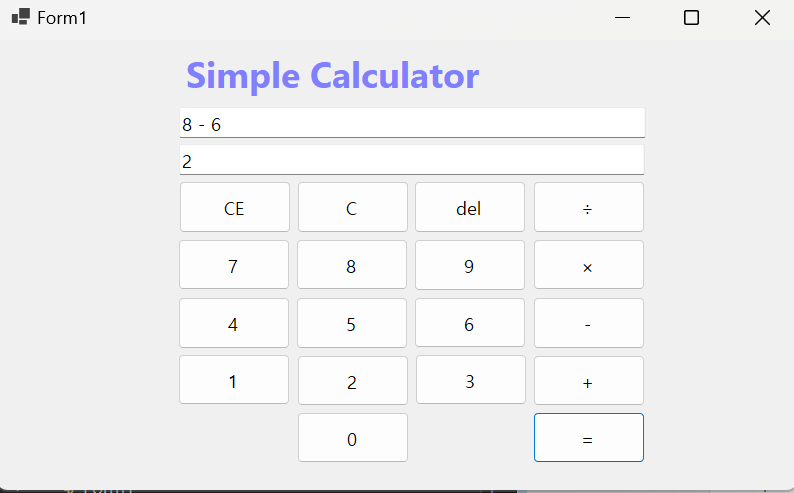
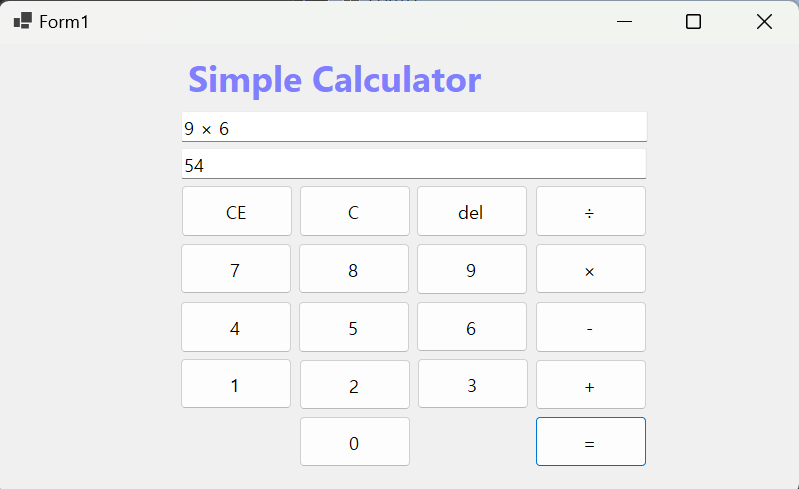
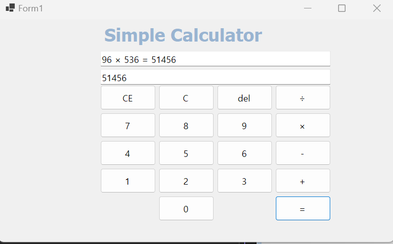
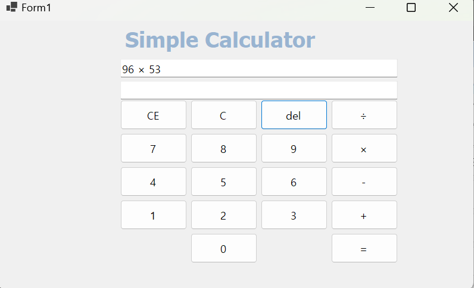
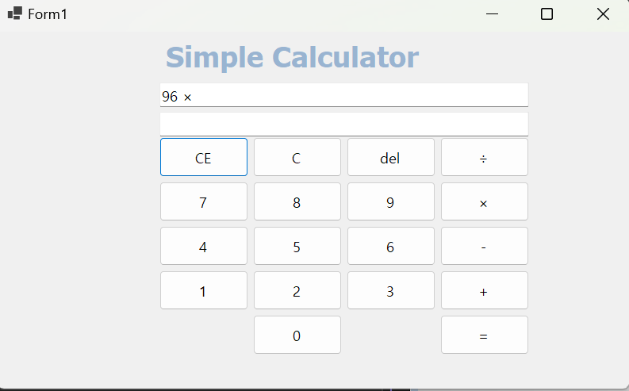
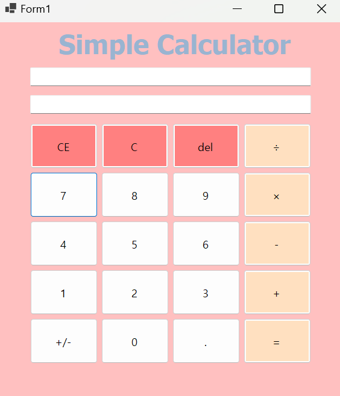
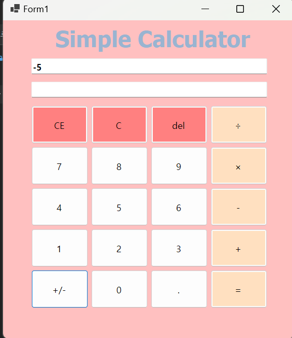
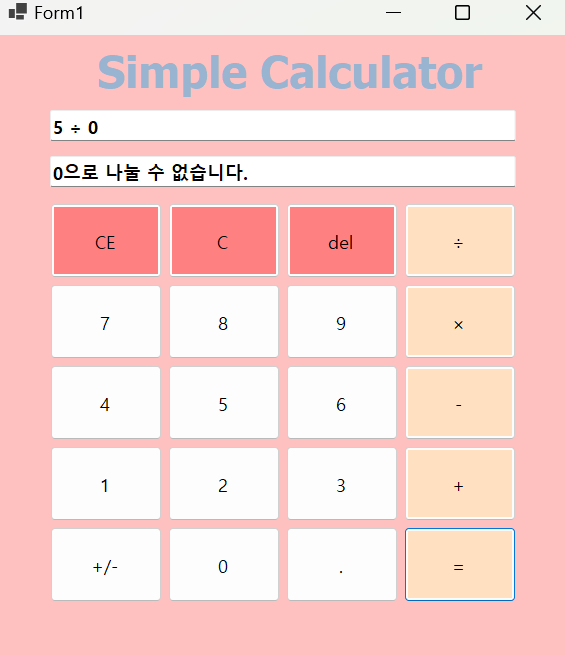

# SimpleCalculator
# (C# 코딩) SimpleCalculator

## 개요
-C# 프로그래밍 학습및 Windows Forms를 이용한 실용적인 계산기 구현

### -1줄소개: Windows Forms와 DataTable 클래스를 활용하여 예외 처리 기능을 갖춘 사칙연산 계산기 구현

### -사용한플랫폼: C#, .NET Windows Forms, Visual Studio, GitHub

### -사용한컨트롤:
  - TextBox: 수식 입력(`txtExpression`) 및 결과 출력(`txtResult`)용
  - Button: 숫자, 연산자, 기능 버튼(C, CE, Del, =, 소수점, 부호전환)
  - Label: 프로그램 제목 및 상태 표시

### -사용한기술과구현한기능: 
  - 문자열 수식 계산: `System.Data.DataTable.Compute` 메소드를 활용한 동적 계산
  - 이벤트 핸들링: 공통 이벤트 핸들러를 통한 효율적인 버튼 클릭 처리
  - 예외 처리: `Try-Catch` 및 `Infinity/NaN` 감지를 통한 '나누기 0' 방지
  - UI/UX 개선: 연산자 자동 교체 로직 및 윈도우 스타일의 CE 기능 구현

 
### -수업중에배우고사용했던클래스들관련된설명

 - System.Data.DataTable: 문자열로 된 수식을 파싱하고 산술 연산을 수행하는 데 사용되었습니다. `Compute` 메소드는 복잡한 연산 우선순위를 자동으로 처리해 줍니다.
 - System.Windows.Forms.Button: 사용자의 입력을 받는 주요 컨트롤로, `sender` 객체를 통해 어떤 버튼이 눌렸는지 식별하는 기술을 익혔습니다.
 - String: `Replace`, `Substring`, `LastIndexOf`, `TrimEnd` 등 다양한 문자열 조작 메소드를 사용하여 수식을 편집하고 가공했습니다.

### -실습중에구현한기능들설명

  - 동적 수식 생성: 숫자를 누를 때마다 문자열을 누적하여 수식을 만듭니다.
  - 연산자 처리: 사칙연산 기호를 입력하고, 계산 시에는 컴퓨터가 이해할 수 있는 기호(`*`, `/`)로 치환합니다.
  - 편집 기능: 입력된 숫자나 수식을 한 글자, 한 단어, 혹은 전체 삭제하는 기능을 구현했습니다.

## 실행화면(과제1)

### -과제1코드의실행스크린샷
 

### -과제내용

1.  Windows Forms 프로젝트 생성 및 기본 계산기 레이아웃 설계
2.  0~9까지의 숫자 버튼 컨트롤 배치 및 속성 설정
3.  텍스트박스를 이용한 수식 입력창 및 결과 출력창 구성
4.  숫자 버튼 클릭 시 텍스트박스에 해당 숫자가 표시되는 기초 로직 수립

### -구현내용과기능설명
1.  숫자 누적 입력: 숫자 버튼 클릭 시 기존 텍스트 뒤에 새로운 숫자가 추가됩니다.
2.  이벤트 연결: 각 숫자 버튼에 동일한 클릭 이벤트 핸들러를 연결하여 코드를 효율화했습니다.
3.  UI 레이아웃: 상단에는 수식, 하단에는 결과가 나오도록 2개의 TextBox를 배치했습니다.
4.  기초 초기화: 프로그램 시작 시 텍스트박스가 비어있는 상태를 유지하도록 설정했습니다.

### -사용한 기술과 구현한 기능
- `btnNumber_Click` 공통 이벤트 핸들러 및 `sender` 객체 활용
- `txtExpression.Text += btn.Text`를 이용한 문자열 누적 기술

## -실행화면(과제2)
### -과제2코드의실행스크린샷

### -과제내용

1.  사칙연산(+, -, ×, ÷) 버튼 추가 및 연산자 입력 기능 구현
2.  결과값 도출을 위한 등호(=) 버튼 기능 추가
3.  문자열 형태의 수식을 실제 산술 연산으로 변환하는 로직 연구
4.  연산자 앞뒤 공백 추가를 통한 수식 가독성 확보

### -구현내용과기능설명

1. 연산자 입력: 버튼 클릭 시 수식창에 연산자가 공백과 함께 입력됩니다.
2.  문자열 치환: 사용자가 보는 `×`, `÷` 기호를 시스템용 `*`, `/`로 자동 변환합니다.
3.  실시간 결과 도출: `=` 버튼을 누르면 문자열 전체를 계산하여 결과창에 띄워줍니다.
4.  연속 입력 지원: 숫자와 연산자를 번갈아 입력하여 긴 수식을 만들 수 있습니다.
 
### -사용한 기술과 구현한 기능

  - `String.Replace` 메소드를 활용한 수식 기호 최적화
  - `System.Data.DataTable.Compute` 클래스를 이용한 문자열 수식 계산

## -실행화면(과제3)
### -과제3코드의실행스크린샷

### -과제내용

1.  입력 오류 수정을 위한 삭제 기능(Del, C, CE) 추가
2.  수식창에 계산 과정과 결과값이 동시에 표시되도록 UI 개선
3.  마지막 피연산자만 선택적으로 삭제하는 로직 구현
4.  전체 초기화 기능을 통한 사용자 편의성 증대

### -구현내용과기능설명

1.  C (Clear): 모든 입력 내용과 결과값을 한 번에 비워줍니다.
2.  Del (Delete): 수식의 가장 마지막 한 글자만 지워 오타를 수정합니다.
3.  CE (Clear Entry): 마지막 연산자 이후에 입력된 숫자 뭉치만 지웁니다.
4.  수식창 결과 포함: `=` 클릭 시 `10 + 20 = 30`과 같이 전체 과정이 표시됩니다.

### -사용한 기술과 구현한 기능

 - `String.Substring` 및 `LastIndexOf`를 활용한 정교한 문자열 자르기
 - `String.Contains`를 이용한 수식 상태(결과 도출 여부) 판별 로직

## -실행화면(과제4)

### -과제4코드의실행스크린샷

### -과제내용

1.  실수 연산을 위한 소수점(`.`) 기능 및 중복 입력 방지 구현
2.  숫자의 양수/음수 상태를 전환하는 부호 전환(`+/-`) 기능 추가
3.  '나누기 0'과 같은 산술적 예외 상황 처리 및 안내 문구 구현
4.  연산자 중복 입력 시 자동 교체 및 Null 안정성 확보를 통한 완성도 향상

### -구현내용과기능설명

1.  나누기 0 방지: 무한대(`∞`, `Infinity`) 발생 시 "0으로 나눌 수 없습니다."를 출력합니다.
2.  연산자 자동 교체: 이미 연산자가 입력된 상태에서 다른 연산자를 누르면 기존 기호를 교체합니다.
3.  소수점 제어: 한 숫자 안에 소수점이 두 번 입력되지 않도록 논리적으로 차단합니다.
4.  윈도우 스타일 CE: 피연산자를 삭제한 후에도 연산자가 남아있으면 `0`으로 고정하여 연속 입력을 돕습니다.

### -사용한 기술과 구현한 기능

 - `TryParse` 및 `ToLower().Contains`를 이용한 무한대(Infinity) 값 검출
 - `sender is Button` 패턴 및 Null 병합 연산자(`??`)를 통한 Null 안정성 확보(CS8600 경고 해결)
